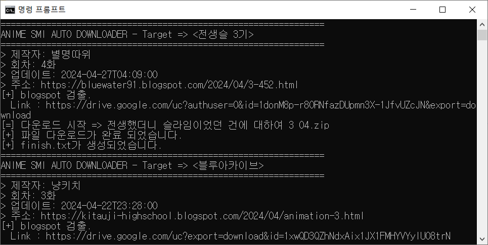
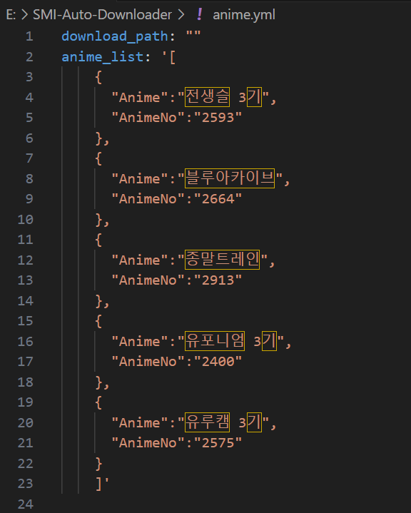
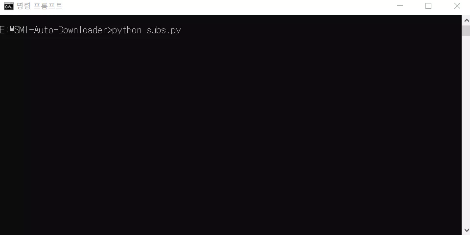
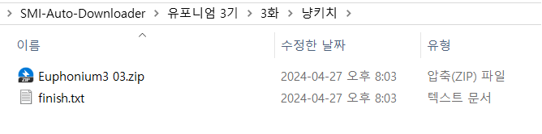
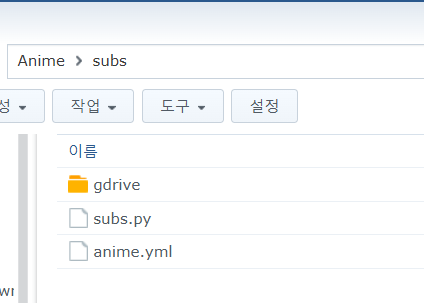
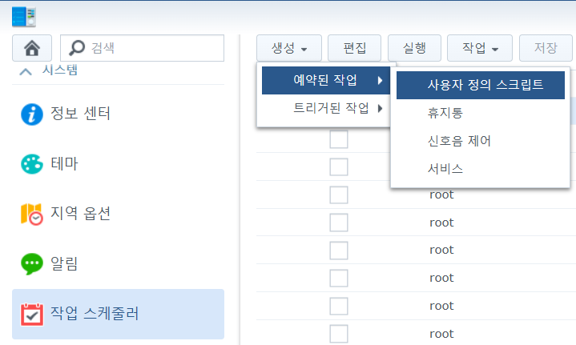
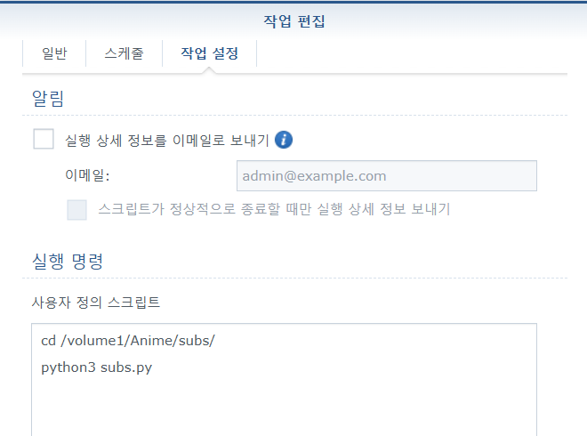

# SMI-Auto-Downloader



자막 릴리즈시 자막을 일괄로 다운받게 해주는 프로그램 입니다.


## 사용방법 

1. **anime.yml** 에서 받고싶은 자막의 애니메이션을 추가합니다.

   

   * AnimeNo는 애니시아(https://anissia.net/anime) 애니메이션 목록에서 확인 가능합니다. 

   * download_path 미기입시 현재 디렉토리(Default)에 저장됩니다.

     * 경로 예시(시놀로지)
     
       ```yaml
       download_path: "/volume1/Anime/Downloads"
       ```
     
     * 경로 예시(윈도우)
     
       ```yaml
       download_path: "E:\\SMI-Auto-Downloader/downloads"
       ```
     
       
     

2. 다음 명령어를 통해 프로그램을 실행합니다.

   ```shell
   python3 subs.py
   ```

   

   

3. 프로그램 실행후 다음과 같은 경로가 생성됩니다.

   

   * 생성경로 :  다운 받을 디렉토리 / 애니메이션 이름 / 회차 / 제작자 / ( *.zip or *.smi )

   * finish.txt : 정상적으로 파일 다운로드가 완료되면 생성되는 파일입니다. 

     finish.txt 에는 메타정보가 포함되어있으며 이후 finish.txt 존재시 해당 다운로드를 스킵합니다.


## NAS를 이용한 다운로더 사용방법

1. Synology NAS에서 작업 스케줄러를 통한 방법

   1. Synology NAS 패키지 센터에서 python3을 설치후, 시놀로지 SSH 터미널에 접속하여 아래와 같은 방법을 진행합니다.

      ```bash
      #1. root 사용자로 변경
      sudo -i
      
      #2. get-pip.py 다운로드
      wget https://bootstrap.pypa.io/get-pip.py
      python3 get-pip.py
      
      #3. 패키지 설치
      python3 -m pip install requests
      python3 -m pip install PyYAML
      python3 -m pip install beautifulsoup4
      python3 -m pip install 'urllib3<2.0'
      ```

   2. Github에서 받은 파일을 시놀로지에 넣습니다. 

      

   3. anime.yml을 열어 다운로드할 작품과 다운경로를 설정합니다.

      ```yml
      download_path: "/volume1/Anime/Downloads"
      anime_list: '[
          {
            "Anime":"최애의 아이 2기",
            "AnimeNo":"2716"
          },
          {
            "Anime":"사슴 어슬렁 어슬렁 호시탐탐",
            "AnimeNo":"2922"
          }
          ]'
      ```

   4. 시놀로지 제어판에서 **작업 스케줄러**를 클릭 후 **생성 -> 예약된 작업 -> 사용자 정의 스크립트**를 클릭합니다.

      

   5. 작업 편집에서 원하는 **스케줄**을 설정한후 **작업설정**에서 아래와 같은 실행명령을 추가합니다.

      

      ```bash
      cd /volume1/{공유폴더이름}/{하위폴더}/
      python3 subs.py
      ```

   6. 이후 시놀로지 작업 스케줄러를 통한 다운로드가 반복적으로 진행됩니다.  

   

2. Ubuntu Crontab을 이용한 방법

   Linux환경에서는 Crontab을 이용하여 스케줄러를 설정하실 수 있습니다.

   ```bash
   */30 * * * * python3 /home/user/subs.py # 예시) 30분 간격으로 실행...
   ```